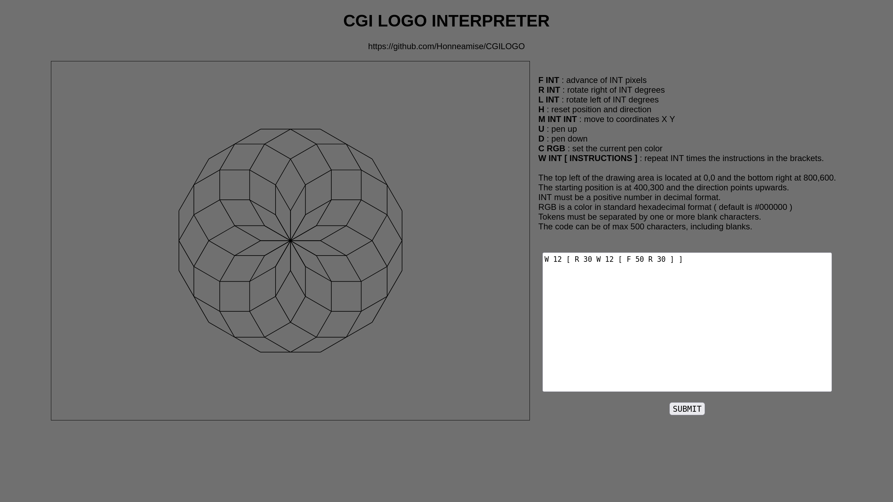

# CGILOGO

This is a very simple Common Gateway Interface written in C .

You can use a subset of the UCB Logo commands to draw images in SVG format.

<b>F INT</b> : advance of INT pixels 
<b>R INT</b> : rotate right of INT degrees 
<b>L INT</b> : rotate left of INT degrees 
<b>H</b> : reset position and direction 
<b>M INT INT</b> : move to coordinates X Y 
<b>U</b> : pen up 
<b>D</b> : pen down 
<b>C RGB</b> : set the current pen color 
<b>W INT [ INSTRUCTIONS ]</b> : repeat INT times the instructions in the brackets. 
 
The top left of the drawing area is located at 0,0 and the bottom right at 800,600. 
The starting position is at 400,300 and the direction points upwards. 
INT must be a positive number in decimal format. 
RGB is a color in standard hexadecimal format ( default is #000000 ) 
Tokens must be separated by one or more blank characters. 
The code can be of max 500 characters, including blanks.
\
\
\
Live demo : https://logo.honny.net
